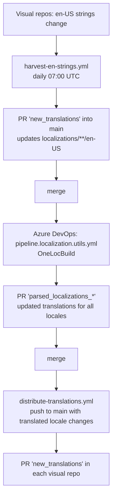

# powerbi-visuals-utils-localizationutils

Central hub for the localization of the Power BI custom visuals owned by Microsoft.

English strings are collected from the visual repositories into this repo, sent for
translation, and the finished translations are pushed back to every visual repository.
The whole cycle is automated; this repo holds the master copy of the translated
resources plus the automation that moves them around.

## Repository layout

| Path | Purpose |
| --- | --- |
| `localizations/<visual>/stringResources/<locale>/resources.resjson` | **Master copy** of the strings for every visual and locale. Source of truth. |
| `visuals/<visual>` | Git submodules pointing at the shipping visual repositories. Used only as transport (read `en-US` from them, write translations back). |
| `descriptions/<visual>/en-US.resjson` | English marketplace descriptions. |
| `deprecatedLocalizations/` | Strings of visuals that are no longer shipped. |
| `src/loc/<locale>/<visual>/en-US/resources.resjson.lcl` | LocStudio output produced by OneLocBuild (English source paired with its translation). |
| `LocProject.json` | OneLocBuild configuration: maps each `localizations/.../en-US/resources.resjson` to its `.lcl` file. |
| `.github/workflows/` | Harvest and distribute workflows (GitHub Actions). |
| `.pipelines/` | Azure DevOps pipeline that runs OneLocBuild. |
| `scripts/create-signed-commit.ps1` | Creates verified commits through the GitHub GraphQL API. |
| `src/parseNewLocalizations.js` | Copies the OneLocBuild output back into `localizations/` (see [npm scripts](#npm-scripts)). |

## How the flow works



**Harvest** — [.github/workflows/harvest-en-strings.yml](.github/workflows/harvest-en-strings.yml)
runs on a daily schedule (visual repos cannot notify this repo directly) or on demand.
It updates the submodules, copies each `visuals/<visual>/stringResources/en-US/resources.resjson`
into `localizations/`, and opens a PR on the fixed branch `new_translations`. The branch
name is fixed on purpose: the existing PR is reused, so review comments and CLA status survive.

**Translate** — the Azure DevOps pipeline
[.pipelines/pipeline.localization.utils.yml](.pipelines/pipeline.localization.utils.yml)
triggers on `main`, runs `OneLocBuild@2` against `LocProject.json`, then
`npm run parseNewLocalizations` copies the translated files from `loc/<locale>/localizations/...`
back into `localizations/<visual>/stringResources/<locale>/`. It opens a
`parsed_localizations_<timestamp>` PR and closes its own older PRs.

**Distribute** — [.github/workflows/distribute-translations.yml](.github/workflows/distribute-translations.yml)
triggers on a push to `main` touching non-en-US files under `localizations/**` (i.e. when a
translation PR merges), or on demand. It copies every translated locale from
`localizations/<visual>/stringResources` into the matching submodule
and opens a `new_translations` PR in every visual repository. `en-US` is not distributed: it
is owned by the visual repository, so copying it back could revert English strings added
there since the last harvest. Files whose only difference is
the line ending are reverted before committing to avoid CRLF-only noise.

There is no separate schedule for distribution — the push event is the signal, and
`workflow_dispatch` covers retries after a partial failure.

## Automation identity

Both automations act as a dedicated GitHub App rather than a user personal access token.
The App is installed on this repository and on every visual repository, with
**Contents: write** and **Pull requests: write** permissions.

* GitHub Actions mint an installation token per job with `actions/create-github-app-token@v2`.
  `repositories` is intentionally omitted so the token covers every repo in the organization
  where the App is installed.
* The Azure DevOps pipeline mints the same kind of token with
  [.pipelines/get-github-app-token.ps1](.pipelines/get-github-app-token.ps1).

App credentials are stored as secrets in the GitHub environment / pipeline variable group
and are never committed to this repository.

The `microsoft` organization requires signed commits. A GitHub App has no GPG key, so
`git commit -S` is not an option; [scripts/create-signed-commit.ps1](scripts/create-signed-commit.ps1)
creates the commit through the GraphQL `createCommitOnBranch` mutation, which GitHub signs
with its own key. Before committing it re-points the bot branch at the current base commit,
so the branch is always exactly one commit ahead of the default branch instead of
accumulating history against an ever older base. It exits with code `3` when there is
nothing to commit or the branch already carries the same content, so an unchanged pull
request is never touched.

## Adding a visual to the localization flow

1. Add the visual repository as a submodule:
   ```powershell
   cd visuals
   git submodule add https://github.com/microsoft/<repo-name>
   ```
2. Add a `LocItem` entry for the visual to [LocProject.json](LocProject.json).
3. Ask a maintainer to install the localization GitHub App on the new repository with
   **Contents: write** and **Pull requests: write** permissions.
4. In the new repository: *Settings > General > Pull Requests* — enable **Allow auto-merge**
  and **Automatically delete head branches**.
5. Open a pull request with the changes above against `main`.

**Automatically delete head branches** should also remain enabled in this repository. The
automation reuses a fixed branch name and rebuilds it from the default branch on every run,
so a branch left behind by a squash merge resolves itself, but deleting merged branches
keeps the repository tidy.

## npm scripts

| Script | Description |
| --- | --- |
| `npm run parseNewLocalizations` | Copies OneLocBuild output from `loc/` into `localizations/`. Used by the ADO pipeline. |

## Running the automation manually

Both workflows expose `workflow_dispatch`, so they can be started from the
**Actions** tab. Use this after a partial failure — the fixed `new_translations`
branch means a rerun updates the existing PR instead of creating a new one.

